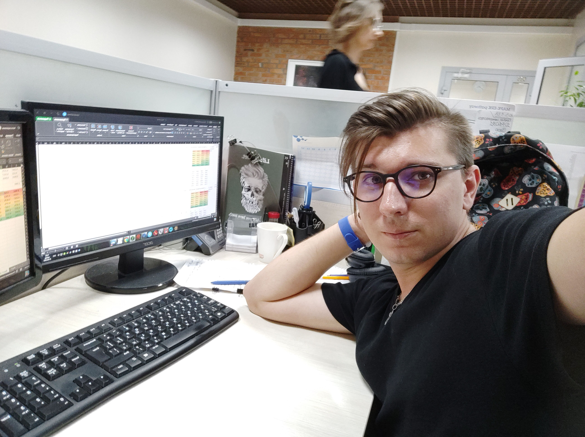

# Leonid Lachmann 👋
### Building reliable infrastructure ☁️ | From scientific R&D to cloud-native systems 🧬

---

### ✉️ Connect with me:

---

### 🚀 About Me

I bring a 15-year foundation in scientific R&D automation. Since 2016, my work has centered on Drug Discovery—leading technical automation and managing massive datasets. This evolved into 5 years in the IT sector, including 3 years explicitly focused on DevOps engineering. Today, I apply this scientific rigor to build resilient, cloud-native systems—fully focused on DevOps and Platform engineering

🌐 **Current Focus:** Infrastructure reliability, Kubernetes optimization, scalable multi-cloud provisioning, and secure monitoring stacks.

🧪 **Domain Expertise:** High-throughput screening pipelines, large-scale database management, and research workflows.

💬 **Ask me about:** Multi-stage Docker environments, Helm templating, and automated ETL pipelines.

🔍 **Looking For:** Open to challenging engineering roles across all industries, with a particular interest in high-load systems, BioPharma, MedTech, and MilTech.

 

---

### 🛠️ Technical Stack

| Category | Technologies |
| :--- | :--- |
| **Cloud & PaaS** |     |
| **Containers & IaC** |     |
| **CI/CD** |   |
| **DataOps & ETL/ELT**|     |
| **Monitoring** |    |
| **Linux** |     |
| **R&D & Scientific** |     |
| **Languages & DBs** |     |

---

### 🏗️ Highlighted Projects & Lab Contributions

* **[On-Premise Monitoring Stack (PoC)](https://github.com/leoleiden/on-premise-monitoring-stack)** Built a secure, scalable monitoring system using **VictoriaMetrics**, **Grafana**, and **Node Exporter** to monitor remote Oracle Linux instances. Integrated with system firewalls (`firewalld`) and enforced metric-scraping security with **SELinux**.

* **[Event-Driven Extension Architecture](https://github.com/leoleiden/SelectionSK_RebirthV3)** Executed a complete migration of the SelectionSK project to Google's Manifest V3 standard. Refactored persistent background logic into an event-driven model using modern Service Workers, ensuring high reliability and strict CSP compliance.

* **[Azure Container Deployment](https://github.com/leoleiden/azure_task_19_deploy_web_app)** Architected a cost-effective PaaS hosting solution. Built and pushed Docker images to Azure Container Registry (ACR), deployed the app to Azure Web Apps for Containers, and performed infrastructure QA via PowerShell scripts. [View Approved PR](https://github.com/mate-academy/azure_task_19_deploy_web_app/pull/20).

* **[Terraform Remote State (Azure & OIDC)](https://github.com/leoleiden/terraform_task_5_state)** — Migrated local Terraform state to a secure remote backend on Azure Blob Storage. Implemented passwordless OIDC authentication via GitHub Actions for safe, collaborative Infrastructure as Code (IaC) management. [View Approved PR](https://github.com/mate-academy/terraform_task_5_state/pull/43).

* **[Advanced CI/CD Pipeline](https://github.com/leoleiden/devops_todolist_cicd_task_6_polish_pipeline/)** — Engineered a robust GitHub Actions workflow for a Django web app. Implemented Docker integration, Matrix testing (OS/Python), concurrency control, environment-specific secrets, and manual deployment approvals. [View Approved PR](https://github.com/mate-academy/devops_todolist_cicd_task_6_polish_pipeline/pull/61).

* **[K8s Observability Stack: Prometheus & Grafana](https://github.com/leoleiden/devops_todolist_monitoring_task/)** — Instrumented a web application to expose custom metrics and deployed the kube-prometheus-stack via Helm. Configured K8s ServiceMonitors for dynamic scraping and built custom Grafana dashboards using PromQL. [View Approved PR](https://github.com/mate-academy/devops_todolist_monitoring_task/pull/49).

* **[Kubernetes Helm Deployment](https://github.com/leoleiden/devops_todolist_kubernetes_task_12_helm_charts/)** — Packaged a Python web application into a custom Helm chart to enable modular, repeatable, and easily configurable Kubernetes deployments. [View Approved PR](https://github.com/mate-academy/devops_todolist_kubernetes_task_12_helm_charts/pull/73).

* **[Kubernetes RBAC Security](https://github.com/leoleiden/devops_todolist_kubernetes_task_12_rbac/)** — Enforced least-privilege security in K8s workloads. Configured custom ServiceAccounts, Roles, and RoleBindings, successfully validating restricted API access from within the pod. [View Approved PR](https://github.com/mate-academy/devops_todolist_kubernetes_task_12_rbac/pull/67).

---

> 🔥 Always shipping code  
> ⚙️ Automating everything  
> 🧬 Science + DevOps brain combo
